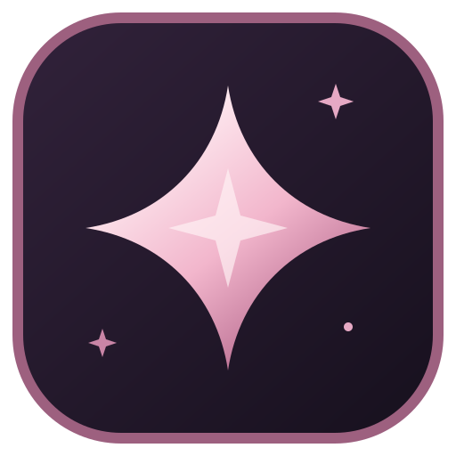

<div align="center">
  
  <h1>AI Usage Hub</h1>
  <p>Yapay zekâ araçların, kullanımları ve uygulama etkinliği tek bir özel masaüstü panelinde.</p>
  <p>
    <a href="README.md">English</a> ·
    <a href="../../releases/latest">İndir</a> ·
    <a href="CHANGELOG.md">Değişiklikler</a> ·
    <a href="CONTRIBUTING.md">Katkıda bulun</a>
  </p>
</div>

AI Usage Hub desteklenen sağlayıcı kotalarını, yerel token ve maliyet toplamlarını, uygulama durumunu, oturumları ve uyarıları bir araya getirir. Kendi bilgisayarında çalışır; desteklenen yerel kaynak bulunduğunda mevcut oturumlarını kullanır. Erişemediği veriyi **kullanılamıyor** diye gösterir.

> **Ölçüm farkı:** Uygulamanın açık kalma süresi, işlemin çalıştığı süreyi gösterir. Bu süre sağlayıcı kotası veya token tüketimi değildir. *Resmî*, *Yerel* ve *Hesaplanan* değerlerin kaynağı ayrı belirtilir; uygulama kalan kota uydurmaz.

## İndir ve kur (Windows)

1. [Son sürüm](../../releases/latest) sayfasından Windows kurulum EXE dosyasını indir.
2. Kurulumu çalıştır. Yalnızca mevcut Windows kullanıcısına kurulur; yönetici hesabı gerekmez.
3. AI Usage Hub'ı açıp kısa başlangıç adımlarını tamamla. Kurulum ve ilk açılış arayüzü İngilizcedir; istersen **Settings → Language** bölümünden Türkçe seçebilirsin. Her sağlayıcının veri durumunu **Integrations**, algılanmayan yerel uygulamaları **Apps** sayfasında yönetebilirsin.

Windows 10/11 ve Microsoft Edge WebView2 gerekir. Kurulum paketi şu an **dijital olarak imzalı değil**; Windows yayıncı uyarısı gösterebilir. Dosyayı yalnızca bu deponun Releases sayfasından indir ve yayımlanan SHA-256 değeriyle karşılaştır. Otomatik güncelleme henüz yok; yeni sürümü mevcut kurulumun üzerine yükleyebilirsin.

## Sağlayıcı desteği

| Kaynak | Gösterilebilen veri | Gereken | Sınır |
| --- | --- | --- | --- |
| **ChatGPT / Codex** | Ortak 5 saatlik ve haftalık kalan yüzdeler, sıfırlanma zamanları, plan ve ayrıca bu cihazdaki yerel token toplamı | Codex kurulu ve giriş yapılmış olmalı | Yerel token kayıtları güvenilir biçimde hesaba bağlanamaz |
| **Claude Desktop / Claude Code** | Claude Desktop'ın yerel plan geçmişinden ortak abonelik kullanımı, ayrı uygulama durumları ve cihazdaki yerel token toplamı | Claude Desktop'ın bir plan geçmişi örneği oluşturmuş olması | Yerel geçmişte kesin sıfırlanma zamanı yok |
| **Google Antigravity** | Gemini ve diğer model kota pencereleri, kalan yüzdeler, sıfırlanma zamanları, hesap ve plan | Antigravity açık ve giriş yapılmış olmalı | Yerel kaynak token ve maliyet toplamı sağlamaz |
| **OpenCode** | Kaydedilmiş sağlayıcı kimlikleri, yerel oturum/token/maliyet toplamları ve herkese açık ücretsiz model kataloğu | Toplamlar için yerel OpenCode verisi | Katalog kişisel kalan kotanı göstermez |
| **Kimi / GitHub Copilot** | Desteklenen yerel uygulama veya editör algılama | Eşleşen işlem | Doğrulanmış abonelik kotası yok |

Sağlayıcı bağlantısı, hesap kimliği, uygulama algılama ve kullanım birbirinden ayrı bilgilerdir. Örneğin kayıtlı bir OpenCode sağlayıcısı, hizmetin şu anda bağlı olduğunu tek başına kanıtlamaz. Kaynak bir sayıyı doğrulayamıyorsa arayüz **Kullanılamıyor** gösterir.

## Gizlilik

- AI Usage Hub'ın **kendi telemetrisi yoktur**. Hesap adları, ayarlar, uygulama oturumları, uyarılar ve kullanım örnekleri yerel SQLite veritabanında kalır.
- Sağlayıcı parolası istemez; API anahtarı, OAuth belirteci veya tarayıcı çerezi saklamaz. Codex ve Antigravity bağdaştırıcıları kurulu uygulamaların yerel arayüzlerini; Claude ve OpenCode ilgili yerel verilerini kullanır.
- Yerel Codex ve Claude konuşma kayıtlarındaki token sayaçları toplam için okunur. Mesaj metni AI Usage Hub tarafından gösterilmez veya saklanmaz.
- OpenCode bağdaştırıcısı sağlayıcı kimliklerini okur, kimlik bilgisi değerlerini yok sayar. Herkese açık model kataloğu isteğinde oturum bilgisi kullanılmaz.
- Kendi hesaplarını ayırt edebilmen için hesap adları uygulamada görünür. Herkese açık hata bildirimine sansürlenmemiş ekran görüntüsü veya veritabanı yükleme.

Veritabanı Windows'ta `%APPDATA%\com.aiusagehub.desktop\ai-usage-hub.sqlite3`, macOS'ta `~/Library/Application Support/com.aiusagehub.desktop/ai-usage-hub.sqlite3` konumundadır. Taşımadan ya da silmeden önce uygulamayı tamamen kapat. Güvenlik ilkeleri: [SECURITY.md](SECURITY.md).

## Kaynaktan çalıştır (Windows)

**Gereksinimler:** Windows 10/11, Node.js 20+, kararlı Rust MSVC araç zinciri, **Desktop development with C++** bileşeniyle Microsoft C++ Build Tools ve WebView2.

```powershell
git clone https://github.com/Hfatih/ai-usage-hub.git
cd ai-usage-hub
npm ci
npm run tauri dev
```

NSIS kurulum paketi oluşturmak için:

```powershell
npm run tauri build
```

Kurulum dosyası `src-tauri/target/release/bundle/nsis/` altında oluşur. Kaynaktan derlemek için herhangi bir sağlayıcı hesabı gerekmez. Yalnızca tarayıcıda açılan Vite önizlemesi kurgusal örnek veriler kullanır; canlı yerel entegrasyonları Tauri uygulamasında kontrol et.

### macOS

macOS uyarlaması kaynak koddan kullanılabilir; imzalı bir macOS sürümü henüz yayımlanmıyor. Node.js 20+, Rust ve Xcode Command Line Tools kurup şu komutları çalıştır:

```sh
npm ci
npm run tauri dev
```

İmzasız `.app` ve `.dmg` üretmek için `./script/package_macos.sh` komutunu kullan. Çıktı `src-tauri/target/release/bundle/` altındadır. `./script/build_and_run.sh` derleme ve başlatmayı tek adımda yapar. Otomatik algılama bir uygulamayı bulamazsa **Uygulamalar** sayfasından `.app` paketini seçebilirsin; yaygın CLI kurulumları `/opt/homebrew/bin`, `/usr/local/bin` ve `~/.local/bin` altında aranır.

İmzasız macOS paketleri yerel geliştirme içindir. Sağlayıcı verileri yine kurulu uygulamaların yerel arayüzlerine ve dosyalarına bağlıdır; bulunamayan kaynaklar kullanılamıyor olarak gösterilir.

## Değişiklikleri doğrula

```powershell
npm test
npm run build
cd src-tauri
cargo test --locked
```

Masaüstü kabuğu Tauri 2 ve Rust; arayüz React, TypeScript ve Vite kullanır. Yerel geçmiş SQLite'ta tutulur. Kaynaklar `src/` ve `src-tauri/src/` altındadır. Katkı ve sürüm adımları için [CONTRIBUTING.md](CONTRIBUTING.md) ile [RELEASING.md](RELEASING.md) dosyalarına bak.

## Bilinen sınırlar

Yeni kurulumlarda arayüz İngilizce başlar; **Settings → Language** bölümünden Türkçe seçebilirsin. Mevcut kurulumlar kayıtlı dil tercihini korur. Çalışan uygulamalar aralıklarla tarandığı için çok kısa açılışlar kaçabilir. Güncel Antigravity kotası için Antigravity açık olmalı; Claude Desktop bir kullanım geçmişi örneği oluşturmuş olmalı. Etkileşimli terminal isteyen bazı CLI açma düğmeleri devre dışıdır. Sağlayıcı verisi uygulamadan bağımsız değişebilir; kartın kaynak ve yenilenme bilgisi hangi verinin gerçekten alındığını gösterir.

## Lisans

MIT — [LICENSE](LICENSE) dosyasına bak. AI Usage Hub bağımsız bir topluluk projesidir; sağlayıcı adları ilgili sahiplerine aittir.
